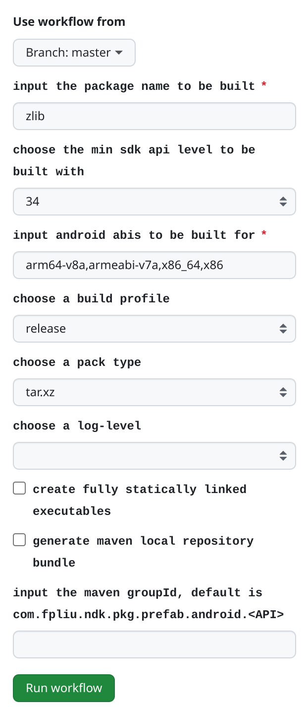
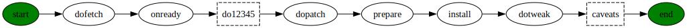

# ndk-pkg

A package builder/manager for [Android NDK](https://developer.android.google.cn/ndk) to build projects written in C, C++, Rust, Golang, etc.

## Caveats

Please read these caveats carefully before starting to use this software.

- This software is being actively developed. It's in beta stage and may not be stable. Some features are subject to change without notice.

- Please do NOT place your own files under `~/.ndk-pkg` directory, as `ndk-pkg` will change files under `~/.ndk-pkg` directory without notice.

- Please do NOT run `ndk-pkg` command in parallel so as not to generate dirty data.

## Platforms that this software can run on

|HostOS|HostArch|SubSystem|recommended|fully tested|fully supported|
|------|--------|---------|-----------|------------|-------|
|✶|`x86_64`|[Docker](https://www.docker.com/)|✔︎|✔︎|✔︎|
|[GNU/Linux](https://www.gnu.org/gnu/linux-and-gnu.en.html)|`x86_64`||✔︎|✔︎|✔︎|
|[Windows](https://www.microsoft.com/en-us/windows/)|`x86_64`|[WSL](https://docs.microsoft.com/en-us/windows/wsl/)||||
|[macOS](https://www.apple.com.cn/mac/)|`x86_64` `arm64`|||✔︎||
|[Android](https://www.apple.com.cn/mac/)|`aarch64`|[Termux](https://termux.dev/)||✔︎||

**Notes** :

- This software can NOT run on [Cygwin](http://cygwin.org/) and [MSYS2](https://www.msys2.org/) due to a cmake error: `CMake: Builds hosted on 'CYGWIN' not supported.`, for the reason please refer to [Android-Determine.cmake](https://github.com/Kitware/CMake/blob/master/Modules/Platform/Android-Determine.cmake#L278-L300). If you really want to use this software on [Windows](https://www.microsoft.com/en-us/windows/), please use via [Docker](https://www.docker.com/) or [WSL](https://docs.microsoft.com/en-us/windows/wsl/) instead.

## Using ndk-pkg via GitHub Actions

This is the recommended way of using this software.

In this way, you don't need to care about other things than:

- which package would you like to build? [lookup package names](https://github.com/leleliu008/ndk-pkg-formula-repository-official-core/tree/master/formula)
- which minimum Android SDK API level would you like to support?
- which Android ABI would you like to build for?
- which build profile would you like to use?

||
|-|
||

For more details please refer to <https://github.com/leleliu008/ndk-pkg-package-manually-build>

## Using ndk-pkg via [Docker](https://www.docker.com/)

This is the recommended way of using this software if you want to use this software locally.

`docker` container is an isolated clean environment where the running process can not be affected by your host system's environemt variables.

**step1. create the ndk-pkg docker container**

```bash
mkdir -p ~/ndk-pkg-home
mkdir -p ~/.m2

docker create -it --name ndk-pkg -v ~/ndk-pkg-home:/root/.ndk-pkg -v ~/.m2:/root/.m2 ubuntu:24.04
```

**step2. start the ndk-pkg docker container**

```bash
docker start ndk-pkg
```

**step3. install ndk-pkg**

```bash
curl -LO https://raw.githubusercontent.com/leleliu008/ndk-pkg/master/ndk-pkg
chmod a+x ndk-pkg
docker cp ndk-pkg ndk-pkg:/usr/bin/
```

**step4. install essential tools**

```bash
docker exec -it ndk-pkg ndk-pkg setup
```

**step5. update formula repositories**

```bash
docker exec -it ndk-pkg ndk-pkg update
```

If all goes well, then next you can start to install packages whatever you want, for example, let's install `curl` package for target `android-35-arm64-v8a`:

```bash
docker exec -it ndk-pkg ndk-pkg install curl --target=android-35-arm64-v8a --static
```

**Note:** you can use `podman` instead of `docker`

## Using ndk-pkg via chroot+ubuntu

This is the recommended way of using this software if you want to use this software locally and your host is `linux-x86_64`.

`chroot` likes `docker` container is an isolated clean environment where the running process can not be affected by your host system's environemt variables.

```bash
curl -LO https://cdimage.ubuntu.com/ubuntu-base/releases/24.04/release/ubuntu-base-24.04.1-base-amd64.tar.gz
install -d ubuntu-rootfs
tar xf ubuntu-base-24.04.1-base-amd64.tar.gz -C ubuntu-rootfs

cp -p /etc/resolv.conf ubuntu-rootfs/etc/

curl -LO https://raw.githubusercontent.com/leleliu008/ndk-pkg/master/ndk-pkg
chmod a+x ndk-pkg
mv ndk-pkg ubuntu-rootfs/bin/

sudo mount -o bind  /dev ubuntu-rootfs/dev
sudo mount -t proc  none ubuntu-rootfs/proc
sudo mount -t sysfs none ubuntu-rootfs/sys
sudo mount -t tmpfs none ubuntu-rootfs/tmp

sudo chroot ubuntu-rootfs ndk-pkg setup -y
sudo chroot ubuntu-rootfs ndk-pkg update
sudo chroot ubuntu-rootfs ndk-pkg install curl --target=android-35-arm64-v8a --static
```

## Using ndk-pkg via chroot+alpine

This is the recommended way of using this software if you want to use this software locally and your host is `linux-x86_64`.

`chroot` likes `docker` container is an isolated clean environment where the running process can not be affected by your host system's environemt variables.

```bash
curl -LO http://dl-cdn.alpinelinux.org/alpine/v3.20/releases/x86_64/alpine-minirootfs-3.20.3-x86_64.tar.gz
install -d alpine-rootfs
tar xf alpine-minirootfs-3.20.3-x86_64.tar.gz -C alpine-rootfs

cp -p /etc/resolv.conf alpine-rootfs/etc/

curl -LO https://raw.githubusercontent.com/leleliu008/ndk-pkg/master/ndk-pkg
chmod a+x ndk-pkg
mv ndk-pkg alpine-rootfs/bin/

sudo mount -o bind  /dev alpine-rootfs/dev
sudo mount -t proc  none alpine-rootfs/proc
sudo mount -t sysfs none alpine-rootfs/sys

sudo chroot alpine-rootfs ndk-pkg setup
sudo chroot alpine-rootfs ndk-pkg update
sudo chroot alpine-rootfs ndk-pkg install curl --target=android-35-arm64-v8a --static
```

## Using ndk-pkg via [WSL](https://docs.microsoft.com/en-us/windows/wsl)

**Note** :

- As of Android NDK r25, due to use of [BOLT](https://github.com/llvm/llvm-project/tree/main/bolt) to optimize the binaries of Android NDK for Linux , Android NDK for Linux is incompatible with WSL1. For more details please refer to https://github.com/android/ndk/issues/1755

**/etc/wsl.conf** :

```ini
[network]
hostname = ubuntu
generateHosts = false

[automount]
enabled = true
root = /mnt/
options = "metadata,umask=22,fmask=11"
mountFsTab = true
```

**installation instructions** :

```bash
# If you want to store ndk-pkg generated data to D:\ partition
export NDKPKG_HOME=/mnt/d/ndk-pkg

# If you use Ubuntu or Debian distribution
sudo apt -y update
sudo apt -y install curl

curl -LO https://raw.githubusercontent.com/leleliu008/ndk-pkg/master/ndk-pkg
chmod a+x ndk-pkg
./ndk-pkg setup
```

## Install ndk-pkg via cURL

**Caveats**:

- Running `ndk-pkg` locally directly on your local host is not recommended due to build tools(e.g. autotools, cmake, etc) are easy to be affected by environment variables. Running `ndk-pkg` in an isolated clean environment (`docker`, `chroot`) are highly recommended.

```bash
curl -LO https://raw.githubusercontent.com/leleliu008/ndk-pkg/master/ndk-pkg
chmod a+x ndk-pkg
./ndk-pkg setup
```

Please try the following URLs if above url is not reachable:

- https://raw.githubusercontents.com/leleliu008/ndk-pkg/master/ndk-pkg
- https://cdn.jsdelivr.net/gh/leleliu008/ndk-pkg/ndk-pkg
- https://gitee.com/fpliu/ndk-pkg/raw/master/ndk-pkg

## Install ndk-pkg via git

```bash
git clone --depth 1 https://github.com/leleliu008/ndk-pkg
ndk-pkg/ndk-pkg setup
```

## ~/.ndk-pkg

**Caveats**: Please do NOT place your own files under `~/.ndk-pkg` directory, as `ndk-pkg` will change (remove, modify, override) files under `~/.ndk-pkg` directory without notice.

a typical hierarchical structure under `~/.ndk-pkg` directory looks like below:

```text
~/.ndk-pkg
├── core
│   ├── SourceCodePro-Light.otf
│   ├── cacert.pem
│   ├── fonts.conf
│   ├── init.sh
│   ├── ndk-pkg-core-2024.05.15-linux-x86_64.tar.xz
│   ├── ndk-pkg-core-latest-release-version
│   ├── uppm
│   ├── wrapper-native-cc
│   ├── wrapper-native-c++
│   ├── wrapper-native-objc
│   ├── wrapper-target-cc
│   └── wrapper-target-c++
├── downloads
│   ├── 8f74213b56238c85a50a5329f77e06198771e70dd9a739779f4c02f65d971313.tgz
│   ├── b3a24de97a8fdbc835b9833169501030b8977031bcb54b3b3ac13740f846ab30.tgz
│   └── c642ae9b75fee120b2d96c712538bd2cf283228d2337df2cf2988e3c02678ef4.tgz
├── installed
│   ├── android-35-arm64-v8a
│   │   ├── f39a5f7836ac7ca1e04de14c8103e663d0b375a524a40e537258747e2deb3c0b
│   │   │   ├── include
│   │   │   ├── lib
│   │   │   └── share
│   │   └── zlib -> f39a5f7836ac7ca1e04de14c8103e663d0b375a524a40e537258747e2deb3c0b
│   ├── android-35-armeabi-v7a
│   │   ├── cc9b367d5068ef6b8aaaee38ec2a25691da35e02757c7e0d83aff3775aef3323
│   │   │   ├── include
│   │   │   ├── lib
│   │   │   └── share
│   │   └── zlib -> cc9b367d5068ef6b8aaaee38ec2a25691da35e02757c7e0d83aff3775aef3323
│   ├── android-35-x86
│   │   ├── a0718632fe829426c1d946e6658cc7586da0039e99d5a140d1e402a6b4a4e2f3
│   │   │   ├── include
│   │   │   ├── lib
│   │   │   └── share
│   │   └── zlib -> a0718632fe829426c1d946e6658cc7586da0039e99d5a140d1e402a6b4a4e2f3
│   └── android-35-x86_64
│       ├── c099047714d4ce1402d66346da88d14f25c313b0d4c879520198426ebc2f36fe
│       │   ├── include
│       │   ├── lib
│       │   └── share
│       └── zlib -> c099047714d4ce1402d66346da88d14f25c313b0d4c879520198426ebc2f36fe
├── native
│   └── linux-x86_64
│       ├── 30b5043e2c5513343152506e5b1e14436ddbb654f7edf69167df05f117fcdb16
│       │   ├── bin
│       │   │   ├── aclocal
│       │   │   ├── aclocal-1.16
│       │   │   ├── automake
│       │   │   └── automake-1.16
│       │   ├── share
│       │   └── receipt.txt
│       └── automake -> 30b5043e2c5513343152506e5b1e14436ddbb654f7edf69167df05f117fcdb16
├── uppm
│   ├── downloads
│   │   ├── fe6b6f7db67a20ccca0385ae38c4aafc7b2bfedc98f9d86880dfeb127a56c012.txz
│   │   └── ff66b70c830a38d331d44f6c25a37b582471def9a161c93902bac7bea3098319.tgz
│   ├── installed
│   │   ├── android-ndk-r26d
│   │   │   ├── CHANGELOG.md
│   │   │   ├── NOTICE
│   │   │   ├── NOTICE.toolchain
│   │   │   ├── README.md
│   │   │   ├── build
│   │   │   ├── meta
│   │   │   ├── ndk-build
│   │   │   ├── ndk-gdb
│   │   │   ├── ndk-lldb
│   │   │   ├── ndk-stack
│   │   │   ├── ndk-which
│   │   │   ├── prebuilt
│   │   │   ├── python-packages
│   │   │   ├── shader-tools
│   │   │   ├── simpleperf
│   │   │   ├── source.properties
│   │   │   ├── sources
│   │   │   ├── toolchains
│   │   │   └── wrap.sh
│   │   ├── bash
│   │   │   ├── bin
│   │   │   └── share
│   │   ├── bsdtar
│   │   │   ├── bin
│   │   │   └── share
│   │   ├── coreutils
│   │   │   ├── bin
│   │   │   ├── libexec
│   │   │   └── share
│   │   ├── curl
│   │   │   ├── bin
│   │   │   └── share
│   │   ├── d2
│   │   │   ├── bin
│   │   │   └── share
│   │   ├── dot_static
│   │   │   └── bin
│   │   ├── findutils
│   │   │   ├── bin
│   │   │   ├── libexec
│   │   │   ├── share
│   │   │   └── var
│   │   ├── gawk
│   │   │   ├── bin
│   │   │   ├── etc
│   │   │   ├── libexec
│   │   │   └── share
│   │   ├── git
│   │   │   ├── bin
│   │   │   ├── libexec
│   │   │   └── share
│   │   ├── grep
│   │   │   ├── bin
│   │   │   └── share
│   │   ├── gsed
│   │   │   ├── bin
│   │   │   └── share
│   │   ├── jq
│   │   │   ├── bin
│   │   │   └── share
│   │   ├── patchelf
│   │   │   ├── bin
│   │   │   └── share
│   │   ├── pkg-config
│   │   │   ├── bin
│   │   │   └── share
│   │   ├── sysinfo
│   │   │   └── bin
│   │   ├── tree
│   │   │   ├── bin
│   │   │   └── share
│   │   ├── xxd
│   │   │   └── bin
│   │   ├── yq
│   │   │   └── bin
│   │   └── zip
│   │       ├── bin
│   │       └── share
│   └── repos.d
│       └── official-core
│           ├── LICENSE
│           ├── README.md
│           └── formula
├── repos.d
│   └── official-core
│       ├── formula
│       │   ├── zlib.yml
│       │   ├── libbz2.yml
│       │   ├── liblzma.yml
│       │   └── libzstd.yml
│       └── README.md
└── run
    ├── 3409784
    ├── 3447656
    └── 3457395
```

## ndk-pkg command usage

- **show help of this command**

    ```bash
    ndk-pkg -h
    ndk-pkg --help
    ```

- **show version of this command**

    ```bash
    ndk-pkg -V
    ndk-pkg --version
    ```

- **show basic information about this software**

    ```bash
    ndk-pkg about
    ```

- **show basic information about your current running operation system**

    ```bash
    ndk-pkg sysinfo
    ```

- **show basic information about the specified location of [Android NDK](https://developer.android.com/ndk)**

    ```bash
    ndk-pkg ndkinfo /usr/local/share/android-ndk
    ```

- **generate url-transform sample**

    ```bash
    ndk-pkg gen-url-transform-sample
    ```

- **install essential tools used by this shell script**

    ```bash
    ndk-pkg setup
    ndk-pkg setup -y
    ```
    This command is mainly doing the following things:

  - install `curl` via your system's package manager if none of `curl` `wget` `http` `lynx` `aria2c` `axel` command is found when `-y` option is given.
  - install [uppm](https://github.com/leleliu008/uppm) to `~/.ndk-pkg/core`
  - install other essential tools (listed below) that are used by this shell script via [uppm](https://github.com/leleliu008/uppm)

    - [GNU Bash](https://www.gnu.org/software/bash/manual/bash.html)
    - [GNU CoreUtils](https://www.gnu.org/software/coreutils/manual/coreutils.html)
    - [GNU FindUtils](https://www.gnu.org/software/findutils/manual/html_mono/find.html)
    - [GNU awk](https://www.gnu.org/software/gawk/manual/gawk.html)
    - [GNU sed](https://www.gnu.org/software/sed/manual/sed.html)
    - [GNU grep](https://www.gnu.org/software/grep/manual/grep.html)
    - [BSD tar](https://man.archlinux.org/man/core/libarchive/bsdtar.1.en)
    - [patchelf](https://github.com/NixOS/patchelf)
    - [sysinfo](https://github.com/leleliu008/C-examples/tree/master/utils/sysinfo)
    - [tree](https://linux.die.net/man/1/tree)
    - [curl](https://curl.se/docs/manpage.html)
    - [git](https://git-scm.com/docs/git)
    - [xxd](https://raw.githubusercontent.com/vim/vim/master/runtime/doc/xxd.man)
    - [fzf](https://github.com/junegunn/fzf)
    - [bat](https://github.com/sharkdp/bat)
    - [jq](https://stedolan.github.io/jq/manual/)
    - [yq](https://mikefarah.gitbook.io/yq/)
    - [d2](https://github.com/terrastruct/d2)
    - [dot](https://graphviz.org/doc/info/command.html)

- **integrate `zsh-completion` script**

    ```bash
    ndk-pkg integrate zsh
    ndk-pkg integrate zsh --output-dir=/usr/local/share/zsh/site-functions
    ndk-pkg integrate zsh -v
    ```

    This software provides a zsh-completion script for `ndk-pkg`. when you've typed `ndk-pkg` then type `TAB` key, the rest of the arguments will be automatically complete for you.

    **Note**: to apply this feature, you may need to run the command `autoload -U compinit && compinit` in your terminal (your current running shell must be zsh).

    **Caveat**: to use this feature, you should put `ndk-pkg` command in `PATH`

- **update all available formula repositories**

    ```bash
    ndk-pkg update
    ```

- **search all available packages whose name matches the given regular expression pattern**

    ```bash
    ndk-pkg search curl
    ndk-pkg search lib
    ```

- **show information of the given available package**

    ```bash
    ndk-pkg info-available curl
    ndk-pkg info-available curl --yaml
    ndk-pkg info-available curl --json
    ndk-pkg info-available curl version
    ndk-pkg info-available curl license
    ndk-pkg info-available curl summary
    ndk-pkg info-available curl web-url
    ndk-pkg info-available curl git-url
    ndk-pkg info-available curl git-sha
    ndk-pkg info-available curl git-ref
    ndk-pkg info-available curl src-url
    ndk-pkg info-available curl src-sha
    ndk-pkg info-available curl src-ft
    ndk-pkg info-available curl src-fp
    ```

- **show information of the given installed package**

    ```bash
    ndk-pkg info-installed android-35-arm64-v8a/curl --prefix
    ndk-pkg info-installed android-35-arm64-v8a/curl --files
    ndk-pkg info-installed android-35-arm64-v8a/curl builtat
    ndk-pkg info-installed android-35-arm64-v8a/curl builtat-iso-8601
    ndk-pkg info-installed android-35-arm64-v8a/curl builtat-rfc-3339
    ndk-pkg info-installed android-35-arm64-v8a/curl builtat-iso-8601-utc
    ndk-pkg info-installed android-35-arm64-v8a/curl builtat-rfc-3339-utc
    ```

- **show packages that are depended by the given package**

    ```bash
    ndk-pkg depends curl

    ndk-pkg depends curl -t d2
    ndk-pkg depends curl -t dot
    ndk-pkg depends curl -t box
    ndk-pkg depends curl -t png
    ndk-pkg depends curl -t svg

    ndk-pkg depends curl -t d2  -o dependencies/
    ndk-pkg depends curl -t dot -o dependencies/
    ndk-pkg depends curl -t box -o dependencies/
    ndk-pkg depends curl -t png -o dependencies/
    ndk-pkg depends curl -t svg -o dependencies/

    ndk-pkg depends curl -o curl-dependencies.d2
    ndk-pkg depends curl -o curl-dependencies.dot
    ndk-pkg depends curl -o curl-dependencies.box
    ndk-pkg depends curl -o curl-dependencies.png
    ndk-pkg depends curl -o curl-dependencies.svg
    ```

- **download resources of the given package to the local cache**

    ```bash
    ndk-pkg fetch curl
    ndk-pkg fetch curl -v
    ```

- **install packages**

    ```bash
    ndk-pkg install curl
    ndk-pkg install android-35-arm64-v8a/curl
    ndk-pkg install android-35-arm64-v8a/curl --static
    ```

- **reinstall packages**

    ```bash
    ndk-pkg reinstall curl
    ndk-pkg reinstall android-35-arm64-v8a/curl --static
    ```

- **uninstall packages**

    ```bash
    ndk-pkg uninstall curl
    ndk-pkg uninstall android-35-arm64-v8a/curl
    ```

- **upgrade the outdated packages**

    ```bash
    ndk-pkg upgrade curl
    ndk-pkg upgrade android-35-arm64-v8a/curl --static
    ```

- **upgrade this software**

    ```bash
    ndk-pkg upgrade-self
    ndk-pkg upgrade-self -v
    ```

- **list all available formula repositories**

    ```bash
    ndk-pkg formula-repo-list
    ```

- **add a new formula repository**

    ```bash
    ndk-pkg formula-repo-add my_repo https://github.com/leleliu008/ndk-pkg-formula-repository-my_repo
    ndk-pkg formula-repo-add my_repo https://github.com/leleliu008/ndk-pkg-formula-repository-my_repo --branch=master
    ndk-pkg formula-repo-add my_repo https://github.com/leleliu008/ndk-pkg-formula-repository-my_repo --branch=main

    ndk-pkg formula-repo-add my_repo https://github.com/leleliu008/ndk-pkg-formula-repository-my_repo --sync
    ndk-pkg formula-repo-add my_repo https://github.com/leleliu008/ndk-pkg-formula-repository-my_repo --sync --branch=master
    ndk-pkg formula-repo-add my_repo https://github.com/leleliu008/ndk-pkg-formula-repository-my_repo --sync --branch=main
    ```

- **delete a existing formula repository**

    ```bash
    ndk-pkg formula-repo-del my_repo
    ```

- **list all available packages**

    ```bash
    ndk-pkg ls-available
    ```

- **list all installed packages**

    ```bash
    ndk-pkg ls-installed
    ```

- **list all outdated packages**

    ```bash
    ndk-pkg ls-outdated
    ```

- **check if the given package is available**

    ```bash
    ndk-pkg is-available curl
    ```

- **check if the given package is installed**

    ```bash
    ndk-pkg is-installed curl
    ndk-pkg is-installed android-35-arm64-v8a/curl
    ```

- **check if the given package is outdated**

    ```bash
    ndk-pkg is-outdated  curl
    ndk-pkg is-outdated  android-35-arm64-v8a/curl
    ```

- **list installed files of the given installed package in a tree-like format**

    ```bash
    ndk-pkg tree curl
    ndk-pkg tree android-35-arm64-v8a/curl -L 3
    ```

- **show logs of the given installed package**

    ```bash
    ndk-pkg logs curl
    ndk-pkg logs android-35-arm64-v8a/curl
    ```

- **bundle the given installed package into a single archive file**

    ```bash
    ndk-pkg bundle android-35-arm64-v8a/curl .tar.gz
    ndk-pkg bundle android-35-arm64-v8a/curl .tar.xz
    ndk-pkg bundle android-35-arm64-v8a/curl .tar.lz
    ndk-pkg bundle android-35-arm64-v8a/curl .tar.bz2
    ndk-pkg bundle android-35-arm64-v8a/curl .zip
    ndk-pkg bundle android-35-arm64-v8a/curl xx.zip
    ndk-pkg bundle android-35-arm64-v8a/curl a/.zip
    ndk-pkg bundle android-35-arm64-v8a/curl a/xx.zip
    ```

- **export the given installed package as the google prefab aar**

    ```bash
    ndk-pkg export android-35-arm64-v8a,x86_64/curl -o .
    ndk-pkg export android-35-arm64-v8a,x86_64/curl -o curl-8.1.2.aar
    ```

- **export the given installed package as the google prefab aar then deploy it to Maven Local Repository**

    ```bash
    ndk-pkg depoly android-35-arm64-v8a,x86_64/curl
    ndk-pkg depoly android-35-arm64-v8a,x86_64/curl --debug
    ndk-pkg depoly android-35-arm64-v8a,x86_64/curl --local=/somewhere
    ```

- **export the given installed package as the google prefab aar then deploy it to Sonatype OSSRH**

    ```bash
    ndk-pkg depoly android-35-arm64-v8a,x86_64/curl --remote < ~/OSSRH-config
    ndk-pkg depoly android-35-arm64-v8a,x86_64/curl --remote <<EOF
    SERVER_ID=OSSRH
    SERVER_URL=https://s01.oss.sonatype.org/service/local/staging/deploy/maven2/
    SERVER_USERNAME=your-sonatype-account-username
    SERVER_PASSWORD=your-sonatype-account-password
    GPG_PASSPHRASE=your-gpg-store-passphase
    EOF
    ```

- **delete the unused cached files**

    ```bash
    ndk-pkg cleanup
    ```

## environment variables

- **HOME**

    This environment variable already have been set on the most operating systems, if not set or set a empty string, you may receive an error message.

- **PATH**

    This environment variable already have been set on the most operating systems, if not set or set a empty string, you may receive an error message.

- **SSL_CERT_FILE**

    ```bash
    curl -LO https://curl.se/ca/cacert.pem
    export SSL_CERT_FILE="$PWD/cacert.pem"
    ```

    In general, you don't need to set this environment variable, but, if you encounter the reporting `the SSL certificate is invalid`, trying to run above commands in your terminal will do the trick.

- **GOPROXY**

    ```bash
    export GOPROXY='https://goproxy.cn'
    ```

- **NDKPKG_URL_TRANSFORM**

    ```bash
    export NDKPKG_URL_TRANSFORM=/path/of/url-transform
    ```

    `/path/of/url-transform` command would be invoked as `/path/of/url-transform <URL>`

    `/path/of/url-transform` command must output a `<URL>`

    you can generate a url-transform sample via `ndk-pkg gen-url-transform-sample`

    If you want to change the request url, you can set this environment variable. It is very useful for chinese users.

- **NDKPKG_DNS_SERVERS**

    DNS servers to be used instead of the system default.

    ```bash
    export NDKPKG_DNS_SERVERS='1.1.1.1,8.8.8.8'
    ```

- **NDKPKG_XTRACE**

    For debugging purposes.

    enable `set -x`:

    ```bash
    export NDKPKG_XTRACE=1
    ```

- **NDKPKG_HOME**

    If this environment variable is not set or set a empty string, `~/.ndk-pkg` will be used as the default value.

    ```bash
    export NDKPKG_HOME=/path/of/ndk-pkg-home
    ```

- **NDKPKG_DEFAULT_TARGET**

    Some ACTIONs of ndk-pkg are associated with an installed package which need `PACKAGE-SPEC` to be specified.

    **PACKAGE-SPEC** : a formatted string that has form: `<TARGET>/<PACKAGE-NAME>`, represents an installed package.

    **PACKAGE-NAME** : should match the regular expression pattern `^[A-Za-z0-9+-_.@]{1,50}$`

    **TARGET** : a formatted string that has form: `android-<ANDROID-API>-<ANDROID-ABI>`

    **ANDROID-API**  : indicates which minimum [Android SDK API Level](https://developer.android.com/tools/releases/platforms) was built with.

    **ANDROID-ABI**  : indicates which [Android ABI](https://developer.android.com/ndk/guides/abis) was built for.

    To simplify the usage, you are allowed to omit `<TARGET>/`. If `<TARGET>/` is omitted, environment variable `NDKPKG_DEFAULT_TARGET` would be checked, if this environment variable is not set, then `android-21-arm64-v8a` will be used as the default.

    **Example**:

    ```bash
    export NDKPKG_DEFAULT_TARGET='android-35-arm64-v8a'
    ```

**Note:** some commonly used environment variables are overridden by this software, these are `CC`, `CXX`, `CPP`, `AS`, `AR`, `LD`, `CFLAGS`, `CPPFLAGS`, `LDFLAGS`, `PKG_CONFIG_LIBDIR`, `PKG_CONFIG_PATH`, `ACLOCAL_PATH`

## ndk-pkg formula scheme

a ndk-pkg formula is a [YAML](https://yaml.org/spec/1.2.2/) format file which is used to config a ndk-pkg package's meta-information including one sentence description, package version, installation instructions, etc.

a ndk-pkg formula's filename suffix must be `.yml`

a ndk-pkg formula'a filename prefix would be treated as the package name.

a ndk-pkg formula'a filename prefix must match regular expression pattern `^[A-Za-z0-9+-._@]{1,50}$`

a ndk-pkg formula's file content only has one level mapping and shall has following KEY:

|KEY|required?|overview|
|-|-|-|
|`pkgtype`|optional|indicates what type of this package. value shall be any one of `exe`, `pie`, `lib`, `exe+lib`.<br>To `exe` type package, `ndk-pkg` would add `--static -static` options to `LDFLAGS` if `--static` install option is given.<br>To `pie` type package, it means that it doesn't support fully statically linking, it is supposed to be dynamically linked.<br>If this mapping is not present, `ndk-pkg` will determine the package type by package name, if a package name starts/ends with `lib`, it would be recognized as type `lib`, otherwise, it would be recognized as type `exe`|
|`summary`|required|describe this package in one sentence.|
|`license`|optional|a space-separated list of [SPDX license short identifiers](https://spdx.github.io/spdx-spec/v2.3/SPDX-license-list/#a1-licenses-with-short-identifiers)|
|`version`|optional|the version of this package.<br>If this mapping is not present, it will be extracted from `src-url` if present, otherwise it will be calculated by running command `date +%Y.%m.%d`|
||||
|`web-url`|optional|the home webpage of this package.<br>If this mapping is not present, use `git-url` if present, otherwise extract from `src-url`.|
||||
|`git-url`|optional|the source code git repository.<br>If `src-url` is not present, this mapping must be present.|
|`git-ref`|optional|reference: <https://git-scm.com/book/en/v2/Git-Internals-Git-References> <br>example values: `HEAD` `refs/heads/master` `refs/heads/main` `refs/tags/v1`, default value is `HEAD`|
|`git-sha`|optional|the full git commit id, 40-byte hexadecimal string, if `git-ref` and `git-sha` both are present, `git-sha` takes precedence over `git-ref`|
|`git-nth`|optional|tell `ndk-pkg` that how many depth commits would you like to be fetched. default is `1`, this would save your time and storage. If you want to fetch all commits, set this to `0`|
||||
|`src-url`|optional|the source code download url of this package.<br>If value of this mapping ends with one of `.zip` `.tar.xz` `.tar.gz` `.tar.lz` `.tar.bz2` `.tgz` `.txz` `.tlz` `.tbz2` `.crate`, it will be uncompressed to `$PACKAGE_WORKING_DIR/src` when this package is installing, otherwise, it will be copied to `$PACKAGE_WORKING_DIR/src`<br>also support format like `dir://DIR`|
|`src-uri`|optional|the mirror of `src-url`.|
|`src-sha`|optional|the `sha256sum` of source code.<br>`src-sha` and `src-url` must appear together.|
||||
|`fix-url`|optional|the patch file download url of this package.<br>If value of this mapping ends with one of `.zip` `.tar.xz` `.tar.gz` `.tar.lz` `.tar.bz2` `.tgz` `.txz` `.tlz` `.tbz2` `.crate`, it will be uncompressed to `$PACKAGE_WORKING_DIR/fix` when this package is installing, otherwise, it will be copied to `$PACKAGE_WORKING_DIR/fix`.|
|`fix-uri`|optional|the mirror of `fix-url`.|
|`fix-sha`|optional|the `sha256sum` of patch file.<br>`fix-sha` and `fix-url` must appear together.|
|`fix-opt`|optional|options to be passed to `patch` command. default value is `-p1`.|
||||
|`patches`|optional|multiple lines of `<fix-sha>\|<fix-url>[\|fix-uri][\|fix-opt]`.|
||||
|`res-url`|optional|other resource download url of this package.<br>If value of this mapping ends with one of `.zip` `.tar.xz` `.tar.gz` `.tar.lz` `.tar.bz2` `.tgz` `.txz` `.tlz` `.tbz2` `.crate`, it will be uncompressed to `$PACKAGE_WORKING_DIR/res` when this package is installing, otherwise, it will be copied to `$PACKAGE_WORKING_DIR/res`.|
|`res-uri`|optional|the mirror of `res-url`.|
|`res-sha`|optional|the `sha256sum` of resource file.<br>`res-sha` and `res-url` must appear together.|
||||
|`reslist`|optional|multiple lines of `<res-sha>\|<res-url>[\|res-uri][\|unpack-dir][\|N]`. `unpack-dir` is relative to `$PACKAGE_WORKING_DIR/res`, default value is empty. `N` is `--strip-components=N`|
||||
|`dep-pkg`|optional|a space-separated list of   `ndk-pkg packages` that are depended by this package when installing and/or runtime, which will be installed via [ndk-pkg](https://github.com/leleliu008/ndk-pkg).|
|`dep-lib`|optional|a space-separated list of libraries that will be linked. library name starts with `-l` will be directly passed to the linker. otherwise, it will be recognized as a `pkg-config` package name and it will be calculated via `pkg-config --libs-only-l ` then passed to the linker.|
|`dep-upp`|optional|a space-separated list of   `uppm packages` that are depended by this package when installing and/or runtime, which will be installed via [uppm](https://github.com/leleliu008/uppm).|
|`dep-pym`|optional|a space-separated list of `python packages` that are depended by this package when installing and/or runtime, which will be installed via [pip3](https://github.com/pypa/pip).|
|`dep-plm`|optional|a space-separated list of    `perl modules` that are depended by this package when installing and/or runtime, which will be installed via [cpan](https://metacpan.org/dist/CPAN/view/scripts/cpan).|
||||
|`ccflags`|optional|append to `CFLAGS`|
|`xxflags`|optional|append to `CXXFLAGS`|
|`ppflags`|optional|append to `CPPFLAGS`|
|`ldflags`|optional|append to `LDFLAGS`|
||||
|`bsystem`|optional|build system name.<br>values can be one or a combination of `autogen` `autotools` `configure` `cmake` `cmake+gmake` `cmake+ninja` `meson` `xmake` `gmake` `ninja` `cargo` `go` `rake` `ndk-build`|
|`bscript`|optional|the directory where the build script is located in, relative to `PACKAGE_WORKING_DIR`. build script such as `configure`, `Makefile`, `CMakeLists.txt`, `meson.build`, `Cargo.toml`, etc.|
|`binbstd`|optional|whether to build in the directory where the build script is located in, otherwise build in other directory.<br>value shall be `0` or `1`. default value is `0`.|
|`movable`|optional|whether can be moved/copied to other locations.<br>value shall be `0` or `1`. default value is `1`.|
|`parallel`|optional|whether to allow build system running jobs in parallel.<br>value shall be `0` or `1`. default value is `1`.|
||||
|`api-min`|optional|specify which minimum Android SDK API level is supported for this package.|
||||
|`onstart`|optional|POSIX shell code to be run when this package's formula is loaded.<br>`PWD` is `$PACKAGE_WORKING_DIR`|
|`onready`|optional|POSIX shell code to be run when this package's needed resources all are ready.<br>`PWD` is `$PACKAGE_BSCRIPT_DIR`|
||||
|`do12345`|optional|POSIX shell code to be run for native build.<br>It is only meaningful when requesting for cross building.<br>It is running in a separated process.|
|`dopatch`|optional|POSIX shell code to be run to apply patches manually.<br>`PWD` is `$PACKAGE_BSCRIPT_DIR`|
|`prepare`|optional|POSIX shell code to be run to do some additional preparation.<br>`PWD` is `$PACKAGE_BSCRIPT_DIR`|
|`install`|optional|POSIX shell code to be run when user run `ndk-pkg install <PKG>`. If this mapping is not present, `ndk-pkg` will run default install code according to `bsystem`.<br>`PWD` is `$PACKAGE_BSCRIPT_DIR` if `binbstd` is `0`, otherwise it is `$PACKAGE_BCACHED_DIR`|
|`doextra`|optional|POSIX shell code to be run to do some extra works immediately after installing.<br>`PWD` is `$PACKAGE_INSTALL_DIR`|
|`dotweak`|optional|POSIX shell code to be run to do some tweaks after `doextra`.<br>`PWD` is `$PACKAGE_INSTALL_DIR`|
||||
|`caveats`|optional|multiple lines of plain text to be displayed after installation.|

|phases of a package's installation|
|-|
||

|build system name|build script file name|
|-|-|
|`meson`|`meson.build`|
|`cmake`|`CMakeLists.txt`|
|`gmake`|`GNUMakefile` or `Makefile`|
|`ninja`|`build.ninja`|
|`xmake`|`xmake.lua`|
|`cargo`|`Cargo.toml`|
|`go`|`go.mod`|
|`rake`|`Rakefile`|
|`autogen`|`autogen.sh`|
|`autotools`|`configure.ac`|
|`configure`|`configure`|
|`ndk-build`|`Android.mk`|

**commands that can be used out of the box:**

|command|usage-example|
|-|-|
|`bash`|[Reference](https://www.gnu.org/software/bash/manual/bash.html)|
|`CoreUtils`|[Reference](https://www.gnu.org/software/coreutils/manual/coreutils.html)|
|`xargs`|[Reference](https://www.gnu.org/software/findutils/manual/html_node/find_html/Invoking-xargs.html)|
|`find`|[Reference](https://www.gnu.org/software/findutils/manual/html_mono/find.html)|
|`gawk`|[Reference](https://www.gnu.org/software/gawk/manual/gawk.html)|
|`gsed`|[Reference](https://www.gnu.org/software/sed/manual/sed.html)|
|`grep`|[Reference](https://www.gnu.org/software/grep/manual/grep.html)|
|`tree`|[Reference](https://linux.die.net/man/1/tree)|
|`jq`|[Reference](https://stedolan.github.io/jq/manual/)|
|`yq`|[Reference](https://mikefarah.gitbook.io/yq/)|
|`d2`|[Reference](https://github.com/terrastruct/d2)|
|`dot_static`|[Reference](https://graphviz.org/doc/info/command.html)|
|`bat`|[Reference](https://github.com/sharkdp/bat)|
|`xxd`|[Reference](https://raw.githubusercontent.com/vim/vim/master/runtime/doc/xxd.man)|
|`git`|[Reference](https://git-scm.com/docs/git)|
|`curl`|[Reference](https://curl.se/docs/manpage.html)|
|`bsdtar`|[Reference](https://man.archlinux.org/man/core/libarchive/bsdtar.1.en)|
|`pkg-config`|[Reference](https://people.freedesktop.org/~dbn/pkg-config-guide.html)|
|`patchelf`|[Reference](https://github.com/NixOS/patchelf)|
|`sysinfo`|[Reference](https://github.com/leleliu008/C-examples/tree/master/utils/sysinfo)|
|||
|`echo`|`echo 'your message.'`|
|`info`|`info 'your information.'`|
|`warn`|`warn "no package manager found."`|
|`error`|`error 'error message.'`|
|`abort`|`abort 1 "please specify a package name."`|
|`success`|`success "build success."`|
|`isInteger`|`isInteger $x \|\| abort 1 "should be an integer."`|
|`isCrossBuild`|`isCrossBuild && abort 1 "This package is not supposed to be cross built."`|
|`wfetch`|`wfetch <URL> [--uri=<URL-MIRROR>] [--sha256=<SHA256>] [-o <PATH> [-q]`|
|||
|`configure`|`configure --enable-pic`|
|`mesonw`|`mesonw -Dneon=disabled -Darm-simd=disabled`|
|`cmakew`|`cmakew -DBUILD_SHARED_LIBS=ON -DBUILD_STATIC_LIBS=ON`|
|`gmakew`|`gmakew`|
|`xmakew`|`xmakew`|
|`cargow`|`cargow`|
|`gow`|`gow`|

**shell variables can be used directly:**

|variable|overview|
|-|-|
|`NDKPKG_ARG0`|the 1st arguments of `ndk-pkg` that you've supplied.|
|`NDKPKG_ARG1`|the 2nd arguments of `ndk-pkg` that you've supplied.|
|`NDKPKG_ARGV`|the all arguments of `ndk-pkg` that you've supplied.|
|`NDKPKG_PATH`|the full path of `ndk-pkg` that you're running.|
|`NDKPKG_HOME`|the home directory of `ndk-pkg` that you're running.|
|`NDKPKG_VERSION`|the version of `ndk-pkg` that you're running.|
|||
|`UPPM`|the executable filepath of [uppm](https://github.com/leleliu008/uppm)|
|||
|`TIMESTAMP_UNIX`|the unix timestamp of this action.|
|||
|`NATIVE_PLATFORM_KIND`|current running os kind. value might be `linux` or `darwin`|
|`NATIVE_PLATFORM_TYPE`|current running os type. value might be `linux` or `macos`|
|`NATIVE_PLATFORM_NAME`|current running os name. value might be `Ubuntu`, `macOS`, etc|
|`NATIVE_PLATFORM_VERS`|current running os version.|
|`NATIVE_PLATFORM_ARCH`|current running os arch. value might be any one of `x86_64`, `arm64`, etc|
|`NATIVE_PLATFORM_NCPU`|current running os's cpu core count.|
|`NATIVE_PLATFORM_EUID`|current running os's effective user ID.|
|`NATIVE_PLATFORM_EGID`|current running os's effective group ID.|
|||
|`TARGET_PLATFORM_VERS`|[android sdk api-level table](https://developer.android.google.cn/guide/topics/manifest/uses-sdk-element#api-level-table)|
|`TARGET_PLATFORM_NBIT`|value shall be any one of `32` `64`|
|`TARGET_PLATFORM_ARCH`|value shall be any one of `armv7a` `aarch64` `i686` `x86_64`|
|`TARGET_PLATFORM_ABI`|value shall be any one of `armeabi-v7a` `arm64-v8a` `x86` `x86_64`|
|`TARGET_TRIPLE`|value shall be any one of `armv7a-linux-androideabi` `aarch64-linux-android` `i686-linux-android` `x86_64-linux-android`|
|||
|`ANDROID_NDK_HOME`|the home directory of `Android NDK`.|
|`ANDROID_NDK_ROOT`|the home directory of `Android NDK`.|
|`ANDROID_NDK_VERSION`|the version of `Android NDK`.|
|`ANDROID_NDK_VERSION_MAJOR`|the major part of version of `Android NDK`.|
|`ANDROID_NDK_TOOLCHAIN_BIND`|the `bin` directory of `Android NDK`.|
|`ANDROID_NDK_SYSROOT`|the `sysroot` directory of `Android NDK`.|
|||
|`CC_FOR_BUILD`|the C Compiler for native build.|
|`CFLAGS_FOR_BUILD`|the flags of `CC_FOR_BUILD`.|
|`CXX_FOR_BUILD`|the C++ Compiler for native build.|
|`CXXFLAGS_FOR_BUILD`|the flags of `CXX_FOR_BUILD`.|
|`CPP_FOR_BUILD`|the C/C++ PreProcessor for native build.|
|`CPPFLAGS_FOR_BUILD`|the flags of `CPP_FOR_BUILD`.|
|`AS_FOR_BUILD`|the assembler for native build.|
|`AR_FOR_BUILD`|the archiver for native build.|
|`RANLIB_FOR_BUILD`|the archiver extra tool for native build.|
|`LD_FOR_BUILD`|the linker for native build.|
|`LDFLAGS_FOR_BUILD`|the flags of `LD_FOR_BUILD`.|
|`NM_FOR_BUILD`|a command line tool to list symbols from object files for native build.|
|`STRIP_FOR_BUILD`|a command line tool to discard symbols and other data from object files for native build.|
|||
|`CC`|the C Compiler.|
|`CFLAGS`|the flags of `CC`.|
|`CXX`|the C++ Compiler.|
|`CXXFLAGS`|the flags of `CXX`.|
|`CPP`|the C/C++ PreProcessor.|
|`CPPFLAGS`|the flags of `CPP`.|
|`AS`|the assembler.|
|`AR`|the archiver.|
|`RANLIB`|the archiver extra tool.|
|`LD`|the linker.|
|`LDFLAGS`|the flags of `LD`.|
|`NM`|a command line tool to list symbols from object files.|
|`STRIP`|a command line tool to discard symbols and other data from object files.|
|||
|`PACKAGE_WORKING_DIR`|the working directory when installing.|
|`PACKAGE_BSCRIPT_DIR`|the directory where the build script (e.g. `Makefile`, `configure`, `CMakeLists.txt`, `meson.build`, `Cargo.toml`, etc) is located in.|
|`PACKAGE_BCACHED_DIR`|the directory where the temporary files are stored in when building.|
|`PACKAGE_INSTALL_DIR`|the directory where the final files will be installed to.|
|||
|`x_INSTALL_DIR`|the installation directory of x package.|
|`x_INCLUDE_DIR`|`$x_INSTALL_DIR/include`|
|`x_LIBRARY_DIR`|`$x_INSTALL_DIR/lib`|

## ndk-pkg formula repository

a typical hierarchical structure of a ndk-pkg formula repository looks like below:

```
NDKPKGFormulaRepoName
├── formula
│   ├── packageA.yml
│   └── packageB.yml
├── LICENSE
└── README.md
```

## ndk-pkg formula repository local location

`${NDKPKG_HOME}/repos.d/${NDKPKGFormulaRepoName}`

## ndk-pkg formula repository local config

a ndk-pkg formula repository's config file is located at `${NDKPKG_HOME}/repos.d/${NDKPKGFormulaRepoName}/.ndk-pkg-formula-repo.yml`

a typical ndk-pkg formula repository's config file content looks like below:

```yaml
url: https://github.com/leleliu008/ndk-pkg-formula-repository-official-core
branch: master
pinned: 0
enabled: 1
created: 1673684639
updated: 1673684767
```

If a ndk-pkg formula repository is `pinned`, which means it would not be updated.

If a ndk-pkg formula repository is `disabled`, which means ndk-pkg would not search formulas in this formula repository.

## ndk-pkg formula repository management

run `ndk-pkg formula-repo-add ` command to create a new formula repository locally.

## ndk-pkg official formula repository

ndk-pkg official formula repository is hosted at <https://github.com/leleliu008/ndk-pkg-formula-repository-official-core>

It would be automatically fetched to your local repository as name `official-core` when you run `ndk-pkg update` command.

**Note:** If you find that a package is not in ndk-pkg official formula repository yet, PR is welcomed.

## Using my prefab aars that have been published to GitHub-Hosted Maven Repository alongside with Android Gradle Plugin

I have published some commonly used packages as google prefab aar to <https://github.com/leleliu008/ndk-pkg-prefab-aar-maven-repo>

## Using my prefab aars that have been published to Maven Central Repository alongside with Android Gradle Plugin

I have published some commonly used packages as google prefab aar to `Maven Central Repository`.

To get the full list of my published packages, please visit the following websites:

- <https://repo1.maven.org/maven2/com/fpliu/ndk/pkg/prefab/android/21/>
- <https://search.maven.org/search?q=com.fpliu.ndk.pkg.prefab>

In the next two sections, I will show you how to configure with `Android Gradle Plugin` in `Kotlin DSL` and `Groovy DSL` respectively.

## configure with Android Gradle Plugin Kotlin DSL

**step1. enable prefab feature for Android Gradle Plugin**

```gradle
android {
    buildFeatures {
        prefab = true
    }
}
```

**step2. enable `Maven Central Repository` for Gradle**

```gradle
allprojects {
    repositories {
        maven {
            mavenCentral()
        }
    }
}
```

中国大陆的用户可使用如下配置：

```gradle
allprojects {
    repositories {
        maven {
            maven { url = uri("https://maven.aliyun.com/repository/public") }
        }
    }
}
```

**step3. add dependencies in build.gradle.kts**

Every package's coordinate for Gradle is `com.fpliu.ndk.pkg.prefab.android.21:<PACKAGE-NAME>:<PACKAGE-VERSION>`, for example, `libpng` package has a version `1.6.37`, we could use it as follows:

```gradle
dependencies {
    implementation ("com.fpliu.ndk.pkg.prefab.android.21:libpng:1.6.37")
}
```

**step4. invoke [find_package(PACKAGE-NAME [REQUIRED] CONFIG)](https://cmake.org/cmake/help/latest/command/find_package.html) command in your Android project's CMakeLists.txt**

Every package provides several cmake imported targets:

|TARGET-NAME|example|summary|
|-|-|-|
|`<PACKAGE-NAME>::headers`|`libpng::headers`|C/C++ header files only|
|`<PACKAGE-NAME>::lib*.a`|`libpng::libpng16.a`|static library|
|`<PACKAGE-NAME>::lib*.so`|`libpng::libpng16.so`|shared library|
|`<PACKAGE-NAME>::*`|`libpng::libpng`|base on .pc files|

Following is a piece of codes show you how to link `libpng.a` which is provided by `libpng` package:

```cmake
find_package(libpng REQUIRED CONFIG)
target_link_libraries(app libpng::libpng.a)
```

or

```cmake
find_package(libpng CONFIG)
if (libpng_FOUND)
    target_link_libraries(app libpng::libpng.a)
endif()
```

**step5. configure C++ standard and STL in build.gradle.kts**

```gradle
android {
    defaultConfig {
        externalNativeBuild {
            cmake {
                arguments += "-DANDROID_STL=c++_shared"
                cppFlags  += "-std=c++17"
            }
        }
    }
}
```

**Note:**

- This step is only required for packages that use `libc++`.
- If you link a shared library that depends on `libc++_shared.so`, then your Android app should use `libc++_shared.so` too.

## configure with Android Gradle Plugin Groovy DSL

**step1. enable prefab feature for Android Gradle Plugin**

```gradle
android {
    buildFeatures {
        prefab true
    }
}
```

**step2. enable `Maven Central Repository` for Gradle**

```gradle
allprojects {
    repositories {
        maven {
            mavenCentral()
        }
    }
}
```

中国大陆的用户可使用如下配置：

```gradle
allprojects {
    repositories {
        maven {
            url 'https://maven.aliyun.com/repository/public'
        }
    }
}
```

**step3. add dependencies in build.gradle**

Every package's coordinate for Gradle is `com.fpliu.ndk.pkg.prefab.android.21:<PACKAGE-NAME>:<PACKAGE-VERSION>`, for example, `libpng` package has a version `1.6.37`, we could use it as follows:

```gradle
dependencies {
    implementation 'com.fpliu.ndk.pkg.prefab.android.21:libpng:1.6.37'
}
```

**step4. invoke [find_package(PACKAGE-NAME [REQUIRED] CONFIG)](https://cmake.org/cmake/help/latest/command/find_package.html) command in your Android project's CMakeLists.txt**

Every package provides several cmake imported targets:

|TARGET-NAME|example|summary|
|-|-|-|
|`<PACKAGE-NAME>::headers`|`libpng::headers`|C/C++ header files only|
|`<PACKAGE-NAME>::lib*.a`|`libpng::libpng16.a`|static library|
|`<PACKAGE-NAME>::lib*.so`|`libpng::libpng16.so`|shared library|
|`<PACKAGE-NAME>::*`|`libpng::libpng`|base on .pc files|

Following is a piece of codes show you how to link `libpng.a` which is provided by `libpng` package:

```cmake
find_package(libpng REQUIRED CONFIG)
target_link_libraries(app libpng::libpng.a)
```

or

```cmake
find_package(libpng CONFIG)
if (libpng_FOUND)
    target_link_libraries(app libpng::libpng.a)
endif()
```

**step5. configure C++ standard and STL in build.gradle**

```gradle
android {
    defaultConfig {
        externalNativeBuild {
            cmake {
                arguments '-DANDROID_STL=c++_shared'
                cppFlags  '-std=c++17'
            }
        }
    }
}
```

**Note:**

- This step is only required for packages that use `libc++`.
- If you link a shared library that depends on `libc++_shared.so`, then your Android app should use `libc++_shared.so` too.

**References:**

- <https://google.github.io/prefab/>
- <https://developer.android.com/studio/projects/android-library#aar-contents>
- <https://developer.android.com/studio/build/dependencies?agpversion=4.1#using-native-dependencies>

**Examples:**

- <https://github.com/leleliu008/android-calendar-for-the-aged>

## Create the google prefab aar then deploy it to Maven Local Repository and use it alongside with Android Gradle Plugin

If my published packages don't meet your needs, you can use this software to install packages then deploy them to `Maven Local Repository`.

In the next two sections, I will show you how to configure with `Android Gradle Plugin` in `Kotlin DSL` and `Groovy DSL` respectively.

## configure with Android Gradle Plugin Kotlin DSL

**step1. build and install libpng**

Suppose you want to build and install `libpng`, the following command will build `libpng` with `android-35` API and build for `arm64-v8a` and `armeabi-v7a` ABI respectively.

```bash
ndk-pkg install android-35-arm64-v8a,armeabi-v7a/libpng
```

**step2. export the installed libpng package as the google prefab aar and deploy it to your Maven Local Repository**

```bash
ndk-pkg deploy  android-35-arm64-v8a,armeabi-v7a/libpng
```

**step3. enable prefab feature for Android Gradle Plugin**

```gradle
android {
    buildFeatures {
        prefab = true
    }
}
```

**step4. enable `Maven Local Repository` for Gradle**

```gradle
allprojects {
    repositories {
        maven {
            mavenLocal()
        }
    }
}
```

**step5. add dependencies in build.gradle.kts**

Every package's coordinate for Gradle is `com.fpliu.ndk.pkg.prefab.android.21:<PACKAGE-NAME>:<PACKAGE-VERSION>`, for example, `libpng` package has a version `1.6.37`, we could use it as follows:

```gradle
dependencies {
    implementation ("com.fpliu.ndk.pkg.prefab.android.21:libpng:1.6.37")
}
```

**step6. invoke [find_package(PACKAGE-NAME [REQUIRED] CONFIG)](https://cmake.org/cmake/help/latest/command/find_package.html) command in your Android project's CMakeLists.txt**

Every package provides several cmake imported targets:

|TARGET-NAME|example|summary|
|-|-|-|
|`<PACKAGE-NAME>::headers`|`libpng::headers`|C/C++ header files only|
|`<PACKAGE-NAME>::lib*.a`|`libpng::libpng16.a`|static library|
|`<PACKAGE-NAME>::lib*.so`|`libpng::libpng16.so`|shared library|
|`<PACKAGE-NAME>::*`|`libpng::libpng`|base on .pc files|

Following is a piece of codes show you how to link `libpng.a` which is provided by `libpng` package:

```cmake
find_package(libpng REQUIRED CONFIG)
target_link_libraries(app libpng::libpng.a)
```

or

```cmake
find_package(libpng CONFIG)
if (libpng_FOUND)
    target_link_libraries(app libpng::libpng.a)
endif()
```

**step7. configure C++ standard and STL in build.gradle.kts**

```gradle
android {
    defaultConfig {
        externalNativeBuild {
            cmake {
                arguments += "-DANDROID_STL=c++_shared"
                cppFlags  += "-std=c++17"
            }
        }
    }
}
```

**Note:**

- This step is only required for packages that use `libc++`.
- If you link a shared library that depends on `libc++_shared.so`, then your Android app should use `libc++_shared.so` too.

## configure with Android Gradle Plugin Groovy DSL

**step1. build and install libpng**

Suppose you want to build and install `libpng`, the following command will build `libpng` with `android-35` API and build for `arm64-v8a` and `armeabi-v7a` ABI respectively.

```bash
ndk-pkg install android-35-arm64-v8a,armeabi-v7a/libpng
```

**step2. export the installed libpng package as the google prefab aar and deploy it to your Maven Local Repository**

```bash
ndk-pkg deploy  android-35-arm64-v8a,armeabi-v7a/libpng
```

**step3. enable prefab feature for Android Gradle Plugin**

```gradle
android {
    buildFeatures {
        prefab true
    }
}
```

**step4. enable `Maven Local Repository` for Gradle**

```gradle
allprojects {
    repositories {
        maven {
            mavenLocal()
        }
    }
}
```

**step5. add dependencies in build.gradle**

Every package's coordinate for Gradle is `com.fpliu.ndk.pkg.prefab.android.21:<PACKAGE-NAME>:<PACKAGE-VERSION>`, for example, `libpng` package has a version `1.6.37`, we could use it as follows:

```gradle
dependencies {
    implementation 'com.fpliu.ndk.pkg.prefab.android.21:libpng:1.6.37'
}
```

**step6. invoke [find_package(PACKAGE-NAME [REQUIRED] CONFIG)](https://cmake.org/cmake/help/latest/command/find_package.html) command in your Android project's CMakeLists.txt**

Every package provides several cmake imported targets:

|TARGET-NAME|example|summary|
|-|-|-|
|`<PACKAGE-NAME>::headers`|`libpng::headers`|C/C++ header files only|
|`<PACKAGE-NAME>::lib*.a`|`libpng::libpng16.a`|static library|
|`<PACKAGE-NAME>::lib*.so`|`libpng::libpng16.so`|shared library|
|`<PACKAGE-NAME>::*`|`libpng::libpng`|base on .pc files|

Following is a piece of codes show you how to link `libpng.a` which is provided by `libpng` package:

```cmake
find_package(libpng REQUIRED CONFIG)
target_link_libraries(app libpng::libpng.a)
```

or

```cmake
find_package(libpng CONFIG)
if (libpng_FOUND)
    target_link_libraries(app libpng::libpng.a)
endif()
```

**step7. configure C++ standard and STL in build.gradle**

```gradle
android {
    defaultConfig {
        externalNativeBuild {
            cmake {
                arguments '-DANDROID_STL=c++_shared'
                cppFlags  '-std=c++17'
            }
        }
    }
}
```

**Note:**

- This step is only required for packages that use `libc++`.
- If you link a shared library that depends on `libc++_shared.so`, then your Android app should use `libc++_shared.so` too.

**References:**

- <https://github.com/google/prefab>
- <https://developer.android.com/studio/projects/android-library#aar-contents>
- <https://developer.android.com/studio/build/dependencies?agpversion=4.1#using-native-dependencies>

**Examples:**

- <https://github.com/leleliu008/ndk-pkg-prefab-example-ffmpeg>
- <https://github.com/leleliu008/ndk-pkg-prefab-example-libphonenumber>
